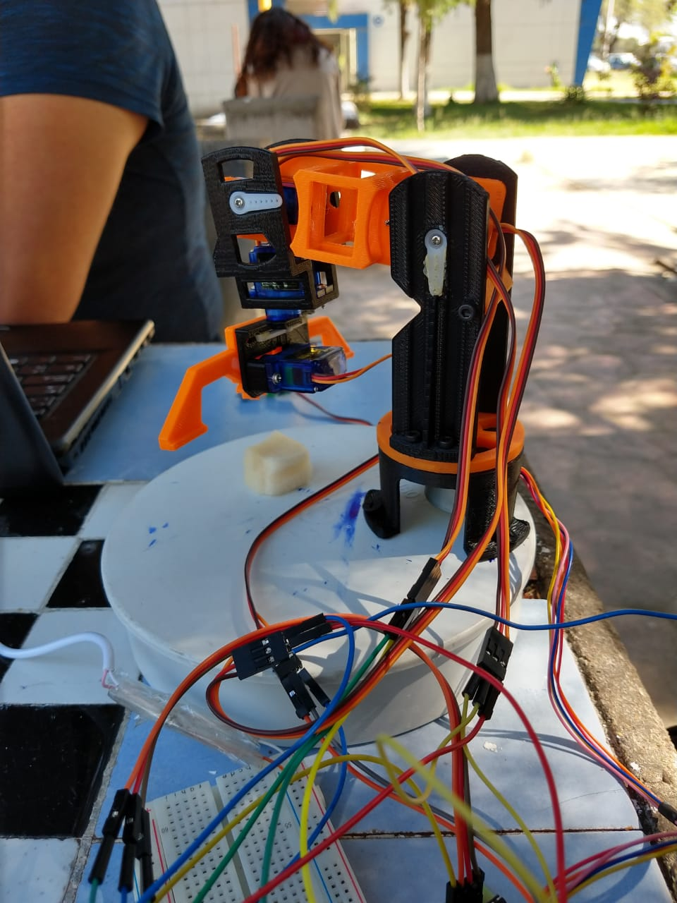
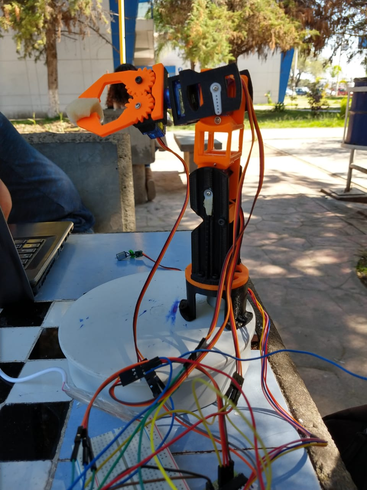
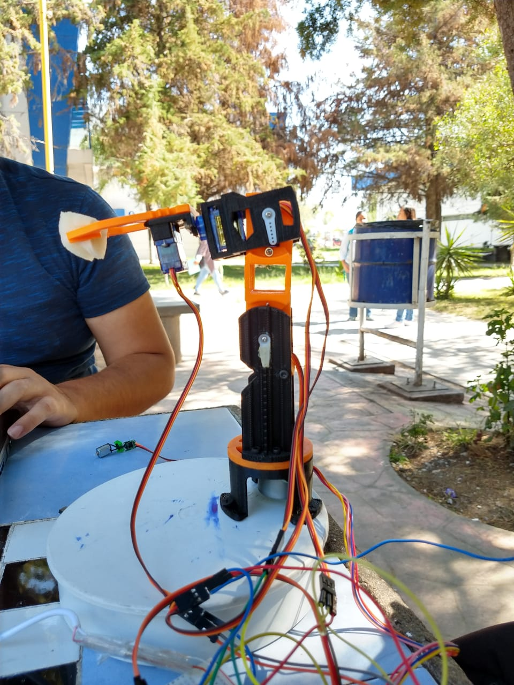
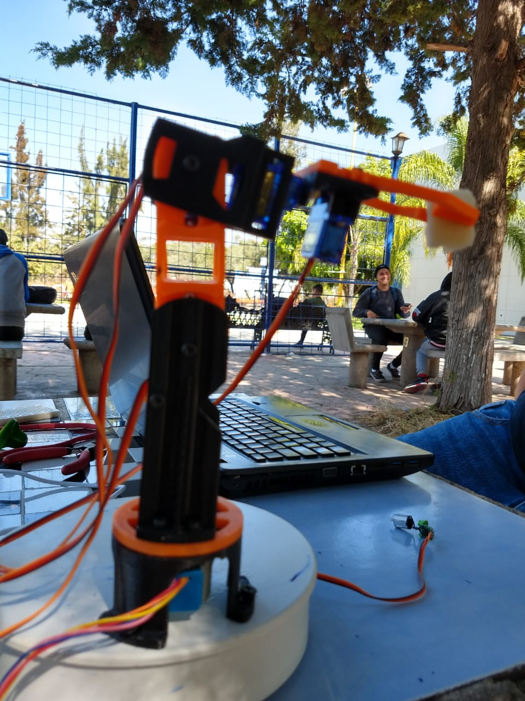
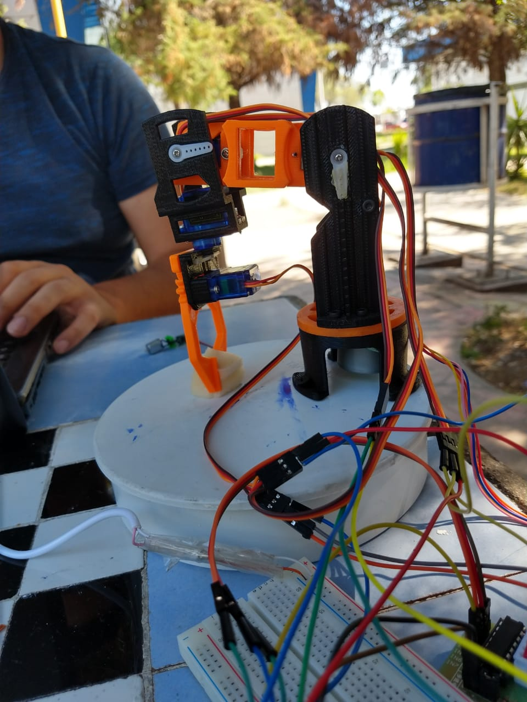

# Brazo Robotico
##Autores
González Alcaraz Hernán Arturo
Nava Torres Juana Cinthia Lizbeth
Padilla Guerrero Paul Adrian 

## Proposito del proyecto
Desarrollar paso a paso una aplicacion para controlar y programar un Brazo Robot, simulando las funciones básicas de un robot industrial.

## Funciones del proyecto
 **Programar:** Registrar las posiciones de los brazos en tres dimensiones (cada registro es un "paso", un programa consiste en una serie de pasos).
 
 **Ejecutar:** Realice en secuencia las posiciones registradas en el "Programa". El robot ejecutará el programa hasta que se use el comando "ABORTAR".

## Descripcion del proyecto
Se controla un robot con 5 DOF(Grados de libertad).
El robot se controla desde una aplicacion en modo "remoto" por medio de una aplicacion en java a través del puerto serial.
El usuario conocera el estado del brazo por medio de LED'S de distintos colores:
  - LED ROJO 1: Pinza
  - LED AMARILLO: Codo
  - LED VERDE: Muñeca
  - LED ROJO 2: Cintura

En caso de existir un fallo de energia, al restablecerse la corriente el brazo robotico continua con la secuencia.(Esto sucede aun con
la aplicacion cerrada).

## Materiales
- 1 Arduino UNO
- 1 Protoboard
- 1 Chasis de Brazo Robótico con 5 Grados de Libertad
- 4 Servomotores
- 1 Motor a Pasos
- 1 Módulo Controlador del Motor a Pasos (Puente H)
- 5 Leds de Colores
- 1 Push Button
- Cables conectores

## Software
- Arduino IDE
- Ubuntu 16.04
- NetBeans IDE
## Librerias
- PanamaHitek
- EEPROM
- Stepper
- Servo

## Brazo Robotico Funcionando
- Abre pinza 

- Cierra pinza para recoger el objeto

- Levanta el objeto

- Mueve muñeca para mostrar objeto

